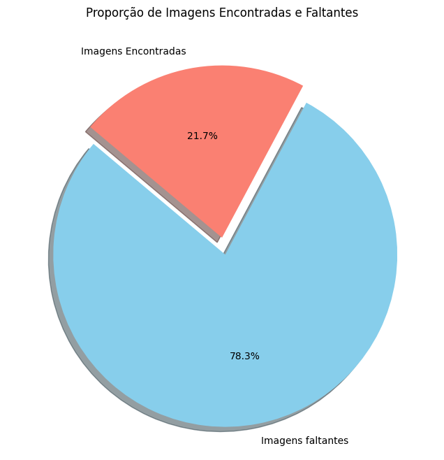
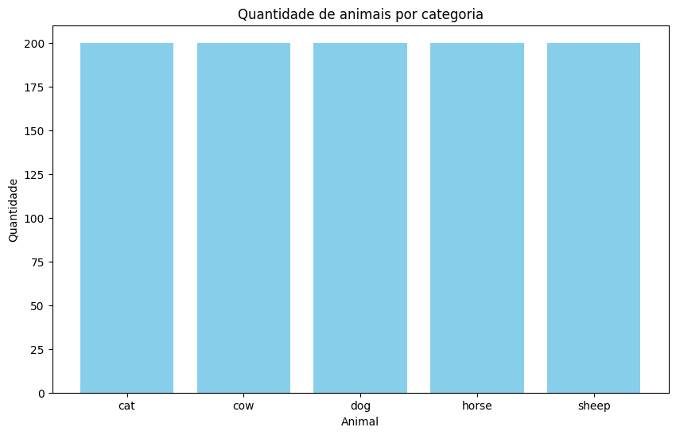
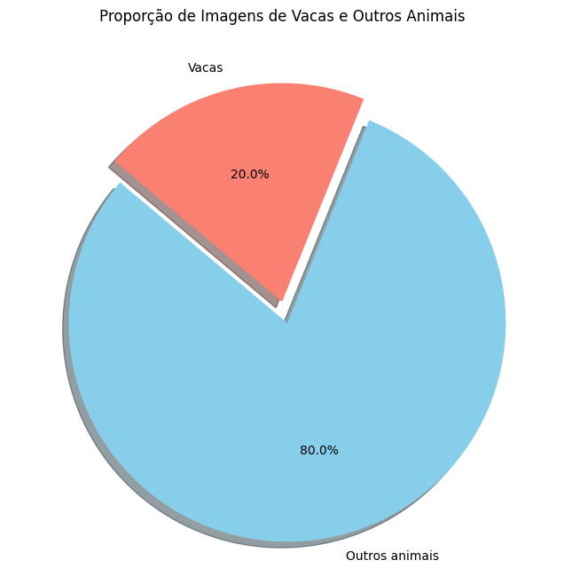

# Ponderada de Pose Estimation - Samuel Lucas

## 1. Análise Exploratória do ANIMAL-POSE DATASET

O [ANIMAL-POSE DATASET](https://sites.google.com/view/animal-pose/) contém uma variedade de imagens de diferentes espécies de animais, incluindo bovinos. Após o download do dataset, realizamos a seguinte análise exploratória.

### Gráficos de Distribuição de Animais
Um gráfico de pizza foi gerado para apresentar a contagem de imagens por categoria de animal. Inicialmente, esperávamos encontrar mais de **4000 imagens**, conforme indicado no arquivo `keypoints.json`. Contudo, após processar o dataset, verificamos que apenas **1000 imagens** estavam disponíveis para análise.

### Descrição Textual
- **Total de imagens disponíveis no dataset**: **1000**
- **Imagens de bovinos encontradas**: **200**
- **Total de imagens no arquivo keypoints.json**: **4000+**
- **Outras categorias de animais**: gatos, cães, cavalos, ovelhas, etc.

## 2. Filtragem do Dataset para Imagens de Bovinos

Para garantir que apenas imagens de bovinos fossem processadas, realizamos o seguinte pré-processamento:

1. **Carregamento das Imagens**: As imagens foram carregadas a partir das subpastas categorizadas.
2. **Anotação das Imagens**: Cada imagem foi associada às suas anotações de pontos chave e bounding boxes, extraídas do arquivo `keypoints.json`.
3. **Filtragem por Animal**: Selecionamos apenas as imagens de bovinos.

### Exemplo Passo-a-Passo do Pré-processamento
- **Carregar Imagens**: Utilizamos uma função para percorrer a pasta e carregar as imagens, encapsulando cada uma em um objeto da classe `Image`, que contém informações como ID da imagem, nome do arquivo e anotações associadas.
- **Anotações**: Mapeamos cada imagem às suas anotações usando o arquivo `keypoints.json`, verificando a disponibilidade das informações.
- **Filtrar Imagens de Bovinos**: Implementamos uma função que verifica se o animal na imagem é um bovino e armazenamos as imagens filtradas.

## 3. Resultados Finais do Processamento

Após o processamento, obtivemos os seguintes resultados:

### Gráficos de Proporção
1. **Proporção de Imagens de Bovinos**: Um gráfico de pizza mostrou que, das **1000 imagens** processadas, apenas **200 eram de bovinos**.

   

2. **Quantidade de Imagens por Categoria**: Uma tabela foi criada para resumir a quantidade de imagens disponíveis por categoria de animal.

   | Animal  | Quantidade |
   |---------|------------|
   | Gatos   | 200        |
   | Bovinos | 200        |
   | Cães    | 200        |
   | Cavalos | 200        |
   | Ovelhas | 200        |

Após as detecções de pose, apenas **6 imagens** apresentaram resultados relevantes, indicando a necessidade de melhorias no processo de detecção.

## 4. Conclusões Pessoais

### Aprendizados
Durante o desenvolvimento deste projeto, aprendi a utilizar bibliotecas como MediaPipe para detecção de poses em imagens de animais e a importância do pré-processamento de dados.

### Limitações
- A qualidade variável do dataset pode impactar a precisão das predições.
- A detecção de poses não foi precisa na maioria das imagens, com apenas 6 delas retornando resultados relevantes.

### Sugestões para Trabalhos Futuros
- **Explorar técnicas de aumento de dados** para melhorar a precisão.
- **Transfer Learning** para aprimorar o desempenho do modelo com dados limitados.
- **Desenvolver uma rede neural personalizada** que possa detectar poses em diversas espécies de animais.

## Observações sobre a Filtragem de Dados

Durante a análise exploratória do ANIMAL-POSE DATASET, a filtragem das imagens revelou desafios significativos. Embora o arquivo `keypoints.json` indicasse a presença de mais de **4000 imagens**, apenas **1000 imagens** estavam disponíveis após a filtragem, e somente **200 imagens** eram de bovinos. Isso levanta questões importantes sobre a representatividade do dataset e a qualidade das anotações.

#### Considerações:
- **Sub-representação de Bovinos:** A escassez de imagens de bovinos pode limitar a eficácia do modelo de detecção de pose, tornando essencial a coleta de mais dados específicos dessa categoria.
- **Qualidade das Anotações:** É crucial garantir que as anotações no arquivo `keypoints.json` sejam precisas e abrangentes, uma vez que a qualidade dos dados impacta diretamente nos resultados do modelo.
- **Impacto nas Conclusões:** A redução significativa no número de imagens disponíveis para análise pode afetar a generalização e a robustez das conclusões tiradas a partir deste estudo.

Essas considerações sugerem que futuras iterações deste projeto deveriam focar na melhoria da coleta de dados e na revisão das anotações para aumentar a confiabilidade dos resultados obtidos.
